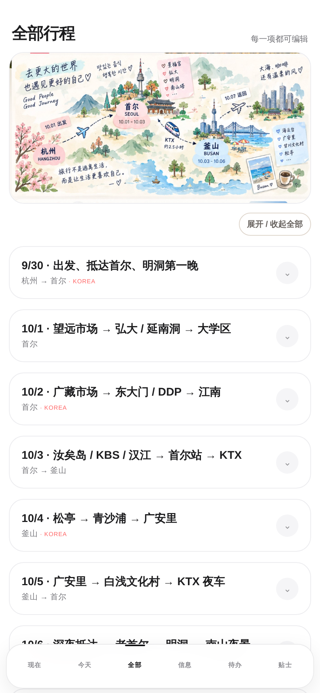
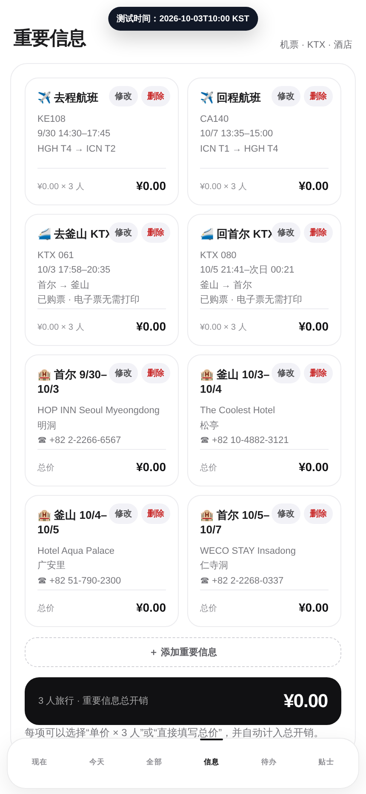

# Trip Pulse Web

一个为韩国旅行制作的单页行程管理网站，适合在手机和桌面浏览器中使用。

## 页面预览

<p align="center">
  
  
  
</p>

<p align="center">
  当前行程 · 全部行程 · 重要信息与总开销
</p>

## 功能

- 按日期浏览旅行行程与地点信息
- 管理重要信息：新增、修改和删除项目
- 支持“单价 × 3 人”与“直接填写总价”两种计价方式
- 自动汇总旅行总开销
- 内置航班、酒店与 KTX 高铁票信息
- 数据保存在浏览器本地存储中

## 本地运行

这是一个无构建步骤的静态网站。可以直接打开 `index.html`，或启动本地静态服务器：

```bash
python3 -m http.server 8765
```

然后访问 <http://127.0.0.1:8765>。

## 改造成其他国家或日期的旅行计划

先 Fork 或下载本仓库，在 Codex、Claude Code 等编程助手中打开项目，然后复制下面的 Prompt。只需替换方括号中的内容；机票、车票和酒店订单截图也可以和 Prompt 一起发送。

```text
请基于当前项目中的韩国旅行网站，为我一键制作一份新的旅行计划网站。直接修改现有 index.html，保留它的视觉风格、移动端布局和所有交互能力，不要从零重写，也不要让我手动查找或替换代码。

我的旅行信息：
- 目的地：[国家，以及会去的城市]
- 旅行日期：[开始日期] 至 [结束日期]
- 出发地：[城市]
- 同行人数：[人数]
- 航班 / 火车 / 酒店：[填写已知信息；没有就写“待定”；如有订单截图，请识别截图内容]
- 必去地点：[地点列表]
- 兴趣偏好：[美食 / 购物 / 自然 / 博物馆 / 亲子 / 夜生活等]
- 行程节奏：[轻松 / 适中 / 紧凑]
- 预算与币种：[例如人民币 15000 元]
- 其他要求：[饮食禁忌、交通偏好、需要预留的自由时间等]

请自动完成以下工作：
1. 将网站中的国家、城市、日期、时区、封面文案和旅行时间边界全部替换为我的行程；使用正确的 IANA 时区。
2. 按天生成合理、可执行的行程，结合地点距离安排顺路路线，并为相邻地点补充距离、预计交通方式和时间；不要编造已经预订的信息。
3. 把已确认的航班、火车、酒店和门票加入“重要信息”；未确认的项目明确标记“待预订”。从订单截图中只提取行程必要信息，不公开订单号、证件号等敏感内容。
4. 将费用计算改为我的同行人数，继续支持“单价 × 人数”和“直接填写总价”，并保证总开销计算正确。
5. 根据目的地更新出发前待办、当地旅行贴士、天气提示、交通建议和紧急信息。
6. 保留“现在、今天、全部、信息、待办、贴士”六个页面，以及行程和重要信息的新增、修改、删除、本地保存功能。
7. 更换 localStorage 存储键，避免读取原韩国行程的旧数据；确保首次打开显示新的默认行程。
8. 使用适合新目的地的封面图和路线概览图；如果无法生成新图片，先使用协调的纯色或渐变占位，不要继续显示韩国素材。
9. 修改完成后启动本地预览，逐页检查桌面端和手机端，测试新增、编辑、删除、价格计算和弹窗按钮；修复发现的问题。

请直接完成修改并给出本地预览地址。除非缺少会导致行程完全无法生成的关键信息，否则请自行做合理假设并在结果中列出，不要停下来反复询问。先不要部署，等我确认预览效果后再上传。
```

如果行程还没有完全确定，也可以先提供日期、目的地和偏好，让 AI 用“待确认 / 待预订”补齐其余内容，之后再通过网页直接编辑。

## 部署

可以直接导入 Vercel 等静态网站托管平台，无需额外构建配置。

## 许可证

[MIT](LICENSE)
